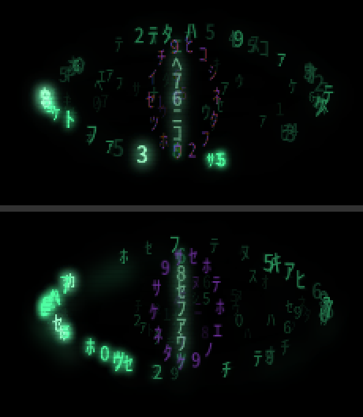

# SPIKE — the eye on the Intel iGPU

> **Retired 2026-09-06 (G07).** The spike crate's `src/`, `Cargo.toml`, `Cargo.lock` and
> `target/` are gone; the GPU backend shipped inside `body/render` (`PLAN-GPU.md`, G01–G07)
> and `measure-gpu.sh` lives at `body/scripts/measure-gpu.sh`. This file and the three
> `shot-*.png` are the record of the measurement that started it.

Spike, not a product change. Question from the owner: *"the GPU layer will be nice just
to test how fast it runs and how much power it draws; maybe it is faster and draws less
power, we don't know."* Measured 2026-09-06, 11:00–12:15, on the live machine
(Alder Lake-P GT2 / Iris Xe, Mesa 26.0.8, XWayland under Mutter). Nothing in the
production path was touched: the unit, `voice.js`, the sidecar and `eye speak` were left
alone, both renderers under test were hand-run offscreen with `--x-offset` and a dead
`DARK_EYE_RENDER_SOCK`, and every process was killed by PID.

## 1. Survey (before writing anything)

- **What exists.** `glutin` + `glow` (GL/GLES context creation, built around `winit`
  windows but able to take a raw window handle); `wgpu` (Vulkan/GL, safe modern API, its
  own surface and swapchain machinery); `femtovg` (a canvas-shaped 2D API over OpenGL —
  the closest thing to cairo's model); `skia-safe` (a full 2D engine, very large build);
  and the bare `khronos-egl` + `glow` pair.
- **Chosen:** `khronos-egl` (dynamic loading) + `glow`, GL ES 3.0, ~640 new lines.
- **Why:** the window is not negotiable — it must stay the same override-redirect,
  32-bit ARGB, XFIXES-input-shaped X11 window that `render/src/window.rs` creates, or the
  eye stops being click-through and always-on-top under Mutter. Every toolkit-based
  option fights that (glutin/winit and wgpu both want to own the window; femtovg's
  helpers likewise), while EGL's `EGL_EXT_platform_xcb` takes the x11rb connection
  pointer and the window XID as they are — 40 lines and no toolkit. The drawing itself is
  ~110 textured quads plus a 3-tap separable blur on a 56×31 buffer, which needs no scene
  graph, so femtovg or skia would add a canvas abstraction the spike never calls and wgpu
  would pull a Vulkan runtime in for a 129 000-pixel surface.

## 2. What was built

`body/render-gpu/` — a **separate crate**, not a feature of `eye-render`. Reason: it adds
`glow`, `khronos-egl` and `libloading` plus the `cairo/png` feature, and a `--features
gpu` inside `render/` would drag that dependency set into the 24/7 production binary's
lockfile and build for no benefit. The crate is a consumer of the production code, not a
fork of it: `rain.rs` (the whole simulation) and `atlas.rs` (the glyph atlas) are included
verbatim with `#[path = "../../render/src/..."]`, and the atlas is packed into a GL
texture through the public `Atlas::blit`, so the glyph pixels on the GPU are byte-for-byte
the ones cairo draws. Only the compositing was rewritten.

| File | What |
|---|---|
| `src/main.rs` | EGL/GLES bring-up on the existing xcb connection, atlas → texture sheets, the idle frame loop (gaze, pulse, breathe, `S` scaling) |
| `src/gpu.rs` | the GL renderer: one instanced draw call for all glyphs, ping-pong phosphor trail, bloom (downscale + 3 box passes each way), composite, scanlines, iris |
| `src/win.rs` | the override-redirect ARGB click-through window, cut down from `render/src/window.rs` (no cairo surface) |
| `src/bin/dump-cpu.rs` | dumps one *software* idle frame to PNG, using the production `Scene` unchanged — this is what makes the side-by-side honest |
| `measure-gpu.sh` | one 60 s window: CPU % of a core, RSS, system GPU busy (RC6), mean GPU clock, RAPL package / core / uncore power |

Run it: `DISPLAY=:0 ./target/release/eye-render-gpu --x-offset -700 --fps 30`
(`--seconds N`, `--dump out.png`, `DARK_EYE_STATS=1`).

## 3. Parity of the look

Top: software (`shot-software.png`). Bottom: GPU (`shot-gpu.png`). Both are frame 300 of
the idle animation over black; the glyph draw is random per run, so the *letters* differ
by design — the shape, the tiers, the wave crest, the trail and the haze are what to
compare.

At parity: the lid curve and the leaf clip on the inner filling, the five brightness tiers
and their baked glow (same atlas pixels), the travelling illumination waves, the slit, the
phosphor trail and its periodic hard wipe, the bloom geometry and strength, the scanlines,
the breathing luminance, the saccade.

Labelled approximations:

1. **Iris glyphs read slightly bolder.** cairo lays them out with Pango at 10 px and
   12 px; the GPU tints one 13 px mask scaled down, so the strokes carry a little more ink.
2. **The blur is not bit-exact.** Same σ, same three box passes each way, same radius 1 —
   but cairo runs them in f32 over an 8-bit plane and divides by the full window at the
   edges (darkening the border), the GPU runs them in 8-bit ping-pong with clamp-to-edge.
   Indistinguishable at this size, not identical.
3. **No dirty rects.** The GPU path clears and redraws the whole 340×380 surface plus six
   blur passes every frame; the software path repaints only the union of what moved.
4. Captions, orbiters, the listening/speaking rings and the heard line are **not ported** —
   the spike renders the idle animation only, which is what was asked for.

## 4. The numbers

60 s windows, each renderer alone, hand-run. `cpu %` and `RSS` are the renderer process
alone (`/proc/<pid>/stat`, `VmRSS`). `GPU busy` is system-wide (100 − RC6 residency) and
therefore includes Mutter compositing the window. `proc GPU` is the renderer's own
`drm-engine-render` from `fdinfo`. Power is RAPL energy deltas. The production
`dark-eye.service` eye, docker and a paused Chrome were running throughout and are in
every row, baselines included.

| Run | CPU % of a core | ms/frame (CPU) | RSS MB | GPU busy % | proc GPU % | GPU MHz | pkg W | core W | **GPU (uncore) W** |
|---|---|---|---|---|---|---|---|---|---|
| baseline (no extra eye) | — | — | — | 20.8 | — | 160 | 15.46 | 10.38 | **0.152** |
| software 30 fps | **4.1** | 1.24–1.51 | 30 | 32.4 | 0.00 | 162 | 15.43 | 10.25 | **0.191** |
| GPU 30 fps | **1.0** | 0.24–0.28 | 100 | 32.8 | 2.05 | 205 | 15.49 | 10.44 | **0.202** |
| baseline (repeat) | — | — | — | 19.5 | — | 145 | 15.50 | 10.49 | **0.151** |
| software 60 fps | **8.7** | 1.25–1.30 | 30 | 41.4 | 0.00 | 260 | 15.43 | 10.12 | **0.230** |
| GPU 60 fps | **1.9** | 0.29 | 100 | 37.3 | 4.45 | 250 | 15.46 | 10.34 | **0.221** |
| baseline (repeat) | — | — | — | 19.9 | — | 120 | 15.49 | 10.47 | **0.152** |

Method note on power: the machine's idle package draw is **15.5 W** (docker, containerd
and Chrome, none of them this spike's business), and package and core power repeat only to
±0.2 W run to run — larger than anything the eye does, so those two columns say nothing
here. The **uncore** domain, which on this part is the iGPU, repeats to ±0.001 W across
three baselines and does resolve the effect. That column is the one to read.

## 5. Verdict

**Faster: yes, clearly, on the CPU.** 1.24–1.51 ms of CPU per frame becomes 0.24–0.29 ms —
a 5× cut in the work per frame, and 4.1 % → 1.0 % of a core at 30 fps, 8.7 % → 1.9 % at
60 fps. At 60 fps the GPU path costs *less than half* what the software path costs at 30.

**Less power: no — not measurably.** The iGPU's own power domain moves by +0.040 W
(software 30) vs +0.050 W (GPU 30), and +0.079 W (software 60) vs +0.070 W (GPU 60):
the same 0.05–0.08 W either way, the difference between them inside the 0.01 W noise. The
reason is visible in the `GPU busy` column — the software renderer already wakes the GPU
just as hard, because Mutter has to composite the damaged ARGB window 30 or 60 times a
second whichever process drew it. Moving the drawing onto the GPU adds the renderer's own
2–4 % of engine time and removes an equivalent amount of blitting from the compositor's
side; at 60 fps the GPU path is in fact the *quieter* of the two (37.3 % vs 41.4 % busy,
0.221 W vs 0.230 W), but that is a 4 % relative difference on a 0.08 W signal.
The CPU time saved (≈3 points of one core at 30 fps) is real but too small to separate
from a 15.5 W package: order 0.2–0.4 W by estimate, under this machine's noise floor.
It would show on a quiet machine, or on battery over hours.

**And it costs 70 MB of RSS.** 30 MB → 100 MB, the Mesa driver and its buffers. That still
fits PLAN-LOWRES §3 target 4 (≤200 MB excluding the voice worker) but eats a third of the
budget, and it is the same objection PLAN-LOWRES §2 raised against wgpu.

**Recommendation: do not port.** The software renderer already meets every §3 target with
room to spare — 1.3 ms per frame against a 2 ms budget, 3–4 % of a core against 1 % for
the whole body once the Electron eye is gone. The GPU buys headroom nobody is short of,
and pays 70 MB plus a whole new failure surface (EGL, Mesa, driver upgrades, GPU resets)
for a 24/7 process nobody watches. The one thing that *would* change the answer is a
bigger or busier eye: a full-screen eye, a 4K TV, or a permanent 60 fps with captions and
orbiters live — there the 5× per-frame factor starts to matter.

**What a full port would cost: 3–5 days.** The idle animation took ~2 h and is the easy
half; what is left is captions (`caption.rs`, 462 lines of Pango layout, katakana decode
noise and per-glyph reveal — needs either a text-to-texture cache or a real text
pipeline), orbiters (216 lines) and the rings and heard line (`overlay.rs`, arcs and
strokes that need a path or SDF shader instead of a `cairo::Context`), then display
on/off with the EGL surface, RandR repositioning, `--stats` parity, and the tests.
`sched.rs` and the socket protocol port unchanged.

**What would be lost:** dirty rects (irrelevant at this cost, but it removes the lever);
the bit-exact blur and the Pango-exact small text (§3 above); 70 MB of RSS; and a renderer
that today depends on nothing but cairo would depend on a working GL stack inside XWayland
for the eye to appear at all.
